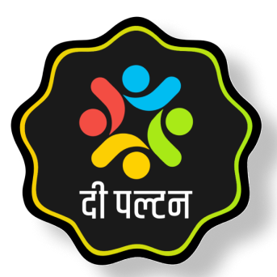

# 📰 द पल्टन (Paltan) - Digital News Platform

<div align="center">
  
  
  **Jahan Khabar sirf headlines nahi hoti, ek samajh bhi hoti hai.**
  
  *Where news is not just headlines, but understanding too.*
  
  [](https://nextjs.org/)
  [](https://reactjs.org/)
  [](https://www.typescriptlang.org/)
  [](https://www.sanity.io/)
  [](https://tailwindcss.com/)
</div>

## ✨ About

**द पल्टन** is a modern, bilingual digital news platform that delivers authentic Hindi journalism with a contemporary approach. Built with cutting-edge web technologies, it provides an engaging reading experience while maintaining journalistic integrity.

### 🎯 Mission
- **Authentic Journalism**: Independent, balanced, and sensitive reporting
- **Digital First**: Modern web experience optimized for all devices
- **Community Focused**: Connecting readers with meaningful stories
- **Bilingual Content**: Seamless Hindi and English content delivery

## 🚀 Features

### 📱 **User Experience**
- **Responsive Design**: Optimized for mobile, tablet, and desktop
- **Dark/Light Theme**: Automatic theme switching with user preference
- **Fast Loading**: Optimized performance with Next.js 15
- **Progressive Web App**: App-like experience on mobile devices

### 📝 **Content Management**
- **Dynamic Articles**: Rich content with multimedia support
- **Category-based Navigation**: Organized by topics (National, Dharma, Society, etc.)
- **Video Integration**: Embedded video content with custom player
- **RSS Feeds**: External news aggregation and custom RSS generation
- **Search Functionality**: Advanced content search across the platform

### 🎨 **Visual Features**
- **Modern UI**: Clean, engaging interface with smooth animations
- **Enhanced Links**: Beautiful link formatting with external domain detection
- **Image Optimization**: Next.js Image component for optimal loading
- **Interactive Cards**: Hover effects and smooth transitions
- **Typography**: Multi-script support with Devanagari fonts

### 📧 **Communication**
- **Contact Forms**: Multiple contact methods with email integration
- **Reader Submissions**: Story submission system for community engagement
- **Social Integration**: Connected with social media platforms
- **Newsletter**: Email subscription for updates

## 🛠️ Tech Stack

### **Frontend**
- **Framework**: Next.js 15.5.2 with App Router
- **Language**: TypeScript 5.0+
- **Styling**: Tailwind CSS with custom components
- **Animations**: Framer Motion for smooth interactions
- **Icons**: Lucide React for consistent iconography

### **Backend & CMS**
- **Content Management**: Sanity CMS with real-time updates
- **Email Service**: Nodemailer for contact forms and submissions
- **Authentication**: NextAuth.js for admin access
- **API Routes**: Next.js API routes for dynamic functionality

### **Performance & SEO**
- **Analytics**: Vercel Analytics and Speed Insights
- **SEO**: Complete meta tags, Open Graph, and Twitter Cards
- **Optimization**: Image optimization, font loading, and code splitting
- **PWA**: Progressive Web App capabilities

## 🚀 Getting Started

### Prerequisites
- Node.js 18.0 or later
- npm or yarn package manager

### Installation

1. **Clone the repository**
   ```bash
   git clone https://github.com/Coup-DeFoudre/paltan-client.git
   cd paltan-client
   ```

2. **Install dependencies**
   ```bash
   npm install
   ```

3. **Environment Setup**
   Create a `.env.local` file in the root directory:
   ```env
   # Sanity Configuration
   NEXT_PUBLIC_SANITY_PROJECT_ID=your_sanity_project_id
   NEXT_PUBLIC_SANITY_DATASET=production
   SANITY_API_TOKEN=your_sanity_token
   
   # Email Configuration
   EMAIL_USER=your_email@domain.com
   EMAIL_PASS=your_app_password
   CONTACT_EMAIL=contact@paltan.com
   
   # NextAuth Configuration
   NEXTAUTH_SECRET=your_nextauth_secret
   NEXTAUTH_URL=http://localhost:3000
   
   # Site Configuration
   NEXT_PUBLIC_SITE_URL=http://localhost:3000
   ```

4. **Run the development server**
   ```bash
   npm run dev
   ```

5. **Open in browser**
   Navigate to [http://localhost:3000](http://localhost:3000)

## 📁 Project Structure

```
paltan-client/
├── app/                    # Next.js App Router pages
│   ├── articles/          # Article pages and routing
│   ├── api/              # API routes (contact, search, etc.)
│   ├── category/         # Category-based article listings
│   └── ...               # Other pages (about, contact, etc.)
├── components/           # Reusable React components
│   ├── homepage/         # Homepage-specific components
│   ├── ArticleContent.tsx # Enhanced article rendering
│   ├── Appbar.tsx       # Navigation component
│   └── ...              # Other UI components
├── lib/                 # Utility functions and configurations
│   ├── sanity.ts        # Sanity client configuration
│   ├── queries.ts       # Sanity GROQ queries
│   └── ...              # Other utilities
├── public/              # Static assets
├── types/               # TypeScript type definitions
└── docs/                # Documentation files
```

## 🎨 Key Components

### **Enhanced Article Rendering**
- Custom link formatting with domain detection
- Rich text processing with Sanity Portable Text
- Responsive image handling and optimization

### **Dynamic Homepage**
- Trending articles carousel
- Category-based content sections
- Real-time notice system
- Featured content highlighting

### **Advanced Search**
- Full-text search across all content
- Category filtering
- Real-time search suggestions

## 📱 Responsive Design

The platform is designed mobile-first with breakpoints for:
- **Mobile**: 320px - 768px
- **Tablet**: 768px - 1024px
- **Desktop**: 1024px+

## 🔧 Scripts

```bash
# Development
npm run dev          # Start development server
npm run build        # Build for production
npm run start        # Start production server
npm run lint         # Run ESLint
npm run type-check   # TypeScript type checking
```

## 🌐 Deployment

### **Vercel (Recommended)**
1. Connect your GitHub repository to Vercel
2. Configure environment variables in Vercel dashboard
3. Deploy automatically on push to main branch

### **Other Platforms**
The application can be deployed on any platform supporting Next.js:
- Netlify
- Railway
- DigitalOcean App Platform
- AWS Amplify

## 🤝 Contributing

We welcome contributions! Please follow these steps:

1. Fork the repository
2. Create your feature branch (`git checkout -b feature/AmazingFeature`)
3. Commit your changes (`git commit -m 'Add some AmazingFeature'`)
4. Push to the branch (`git push origin feature/AmazingFeature`)
5. Open a Pull Request

### 👨‍💻 Development Team
- **Lead Developer**: [Rishabh Pathak](https://github.com/Coup-DeFoudre)

## 📄 License

This project is licensed under the MIT License - see the [LICENSE](LICENSE) file for details.

## 🙏 Acknowledgments

- **Next.js Team** for the amazing framework
- **Sanity** for the flexible CMS solution
- **Vercel** for hosting and analytics
- **Tailwind CSS** for the utility-first styling approach
- **Our Readers** for supporting independent journalism

---

<div align="center">
  <p><strong>द पल्टन</strong> - Independent Digital Journalism</p>
  <p>Built with ❤️ for the community</p>
</div>
